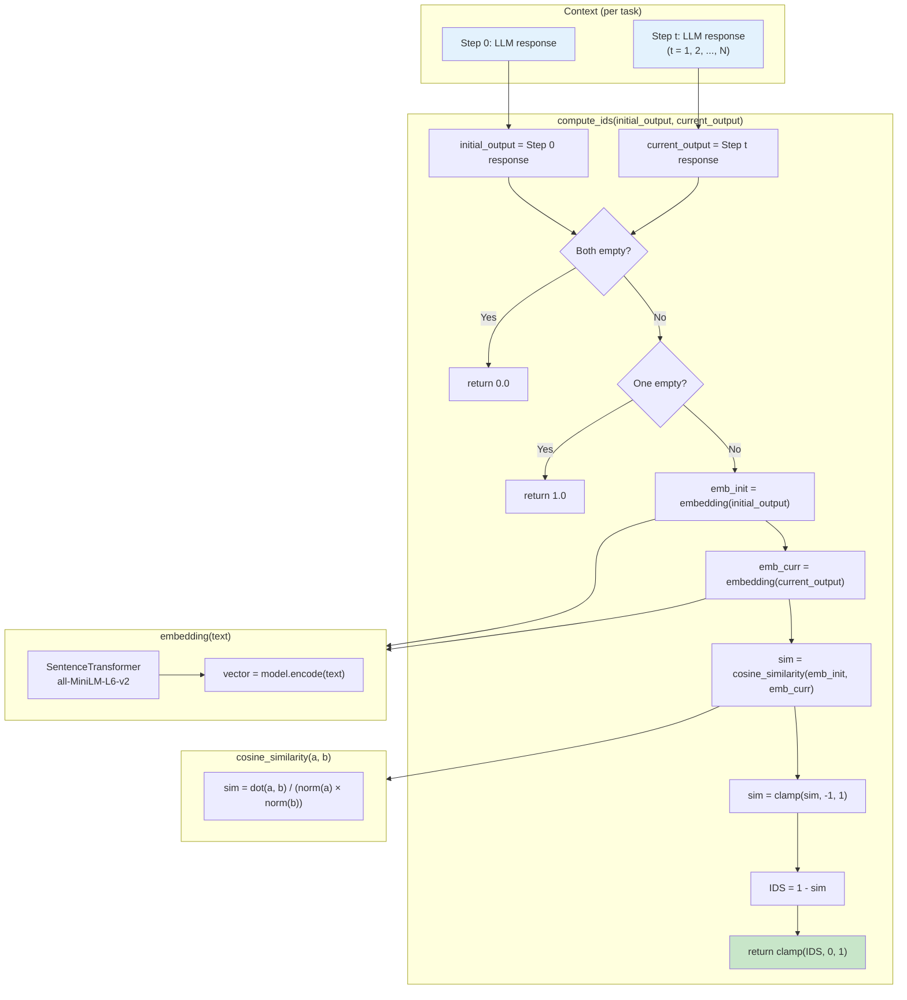

# Intent Drift Score (IDS) — Calculation Flowchart



## Formula

```
IDS_t = 1 - cosine_similarity(embedding(initial_output), embedding(current_output))
```

- **IDS = 0** → perfectly aligned (same semantics as step 0)
- **IDS = 1** → maximum drift (orthogonal or opposite semantics)

## Aggregation (per task)

| Metric | Formula |
|--------|---------|
| **mean IDS** | mean(IDS_1, IDS_2, ..., IDS_N) — steps 1..N only |
| **max IDS** | max(IDS_1, ..., IDS_N) |

Step 0 has IDS = 0 (reference); drift is measured for steps 1 onward.
