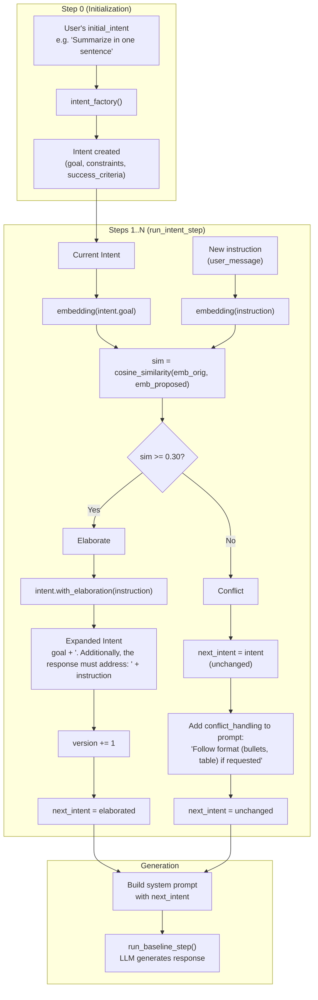

# Intent Fusion Engine — Update Flowchart



Note: `next_intent` becomes the current intent for the next step. The LLM generates the response but does not modify the intent.

## Summary

| Condition | Intent Update | Prompt Addendum |
|-----------|---------------|-----------------|
| **sim ≥ 0.30** | Elaborated: goal + "Additionally, the response must address: [instruction]" | None |
| **sim < 0.30** | Unchanged | Conflict note: follow requested format while staying aligned |

## with_elaboration()

```
expanded_goal = goal + ". Additionally, the response must address: " + instruction + "."
→ new Intent with version bumped
```

## Thresholds

- **LOW_THRESHOLD = 0.30**: Below this → treat as conflict (instruction diverges from intent)
- **HIGH_THRESHOLD = 0.75**: (Historical; currently sim ≥ LOW triggers elaboration)
