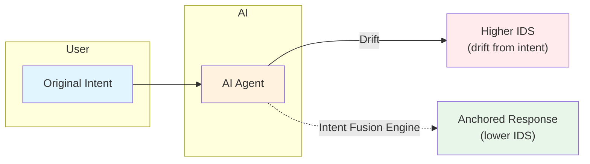
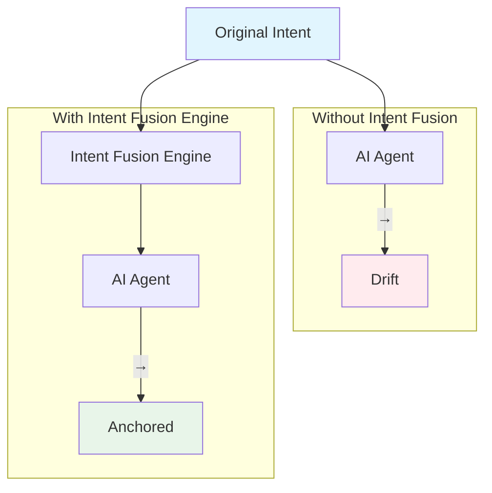
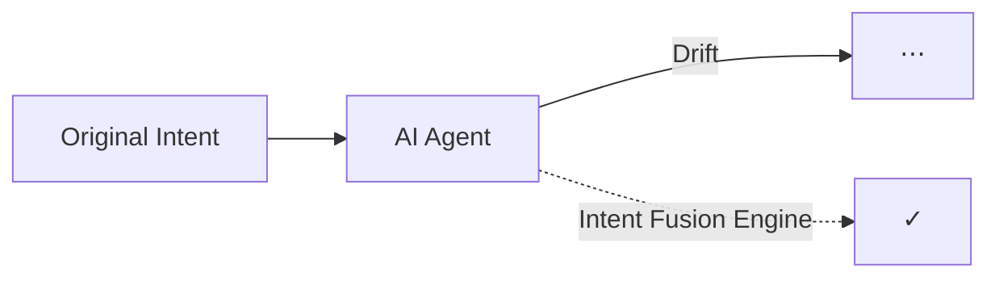

# Intent Drift Experiment — Presentation Flowchart

```mermaid
flowchart LR
    subgraph User
        INTENT["Original Intent"]
    end

    subgraph AI
        AGENT["AI Agent"]
    end

    INTENT --> AGENT

    AGENT -->|"Drift"| DRIFT["Higher IDS\n(drift from intent)"]
    AGENT -.->|"Intent Fusion Engine"| ANCHOR["Anchored Response\n(lower IDS)"]

    style INTENT fill:#e1f5fe
    style AGENT fill:#fff3e0
    style DRIFT fill:#ffebee
    style ANCHOR fill:#e8f5e9
```

## Alternative: Side-by-side comparison

```mermaid
flowchart TB
    INTENT["Original Intent"]

    subgraph Baseline["Without Intent Fusion"]
        B_AGENT["AI Agent"]
        B_DRIFT["Drift"]
    end

    subgraph IntentFusion["With Intent Fusion Engine"]
        I_AGENT["AI Agent"]
        I_ENGINE["Intent Fusion Engine"]
        I_ANCHOR["Anchored"]
    end

    INTENT --> B_AGENT
    B_AGENT -->|"→"| B_DRIFT

    INTENT --> I_ENGINE
    I_ENGINE --> I_AGENT
    I_AGENT -->|"→"| I_ANCHOR

    style INTENT fill:#e1f5fe
    style B_DRIFT fill:#ffebee
    style I_ANCHOR fill:#e8f5e9
```

## Minimal (single-flow, for slides)

```mermaid
flowchart LR
    A["Original Intent"] --> B["AI Agent"]
    B -->|Drift| C["⋯"]
    B -.->|Intent Fusion Engine| D["✓"]
```
