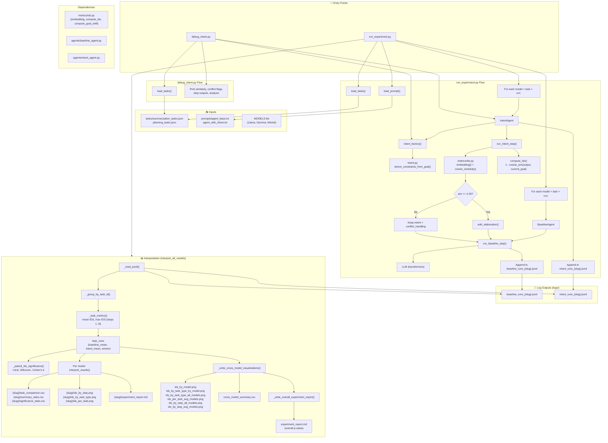

# Intent Drift Experiment — Data Flow

## Data Flow Summary

### 1. Input → Execution

| Source | Data | Consumed By |
|--------|------|-------------|
| `tasks/*.json` | `initial_intent`, `steps`, `article`/`context` | run_experiment, debug_intent |
| `prompts/*.txt` | System prompts (baseline vs intent-aware) | BaselineAgent, IntentAgent |
| MODELS | HuggingFace model names | Both agents |

### 2. Agent Execution

**BaselineAgent**: Uses `agent_base.txt` → builds conversation → LLM generates → no IDS computed during run (IDS computed later in interpret).

**IntentAgent**: Uses `agent_with_intent.txt` + Intent block → at each step:
- Computes `sim = cosine_similarity(goal_emb, instruction_emb)`
- If sim ≥ 0.30: elaborates intent
- If sim < 0.30: keeps intent + adds conflict_handling note
- Calls `run_baseline_step()` (shared with BaselineAgent)
- Computes `IDS_t = 1 - cosine_similarity(initial_output, current_output)` per step

### 3. Log Format (JSONL)

Each line: `{task_id, step, output, ids, ...}`. Grouped by `task_id` during interpretation.

### 4. Interpretation Pipeline

1. **Load** baseline + intent JSONL → group by task_id
2. **Metrics** per task: mean IDS (steps 1..N), max IDS
3. **Compare**: baseline_mean vs intent_mean → winner
4. **Per-model**: CSV, PNG, report in `logs/{slug}/`
5. **Cross-model**: aggregate PNGs, `cross_model_summary.csv`
6. **Overall**: pool all (model, task) pairs → paired t-test → `experiment_report.md`

### 5. Output Files

| Location | Files |
|----------|-------|
| `logs/` | `experiment_report.md`, `cross_model_summary.csv`, `ids_*.png` |
| `logs/{model-slug}/` | `task_comparison.csv`, `summary_stats.csv`, `significance_stats.csv`, `experiment_report.md`, `ids_*.png` |
