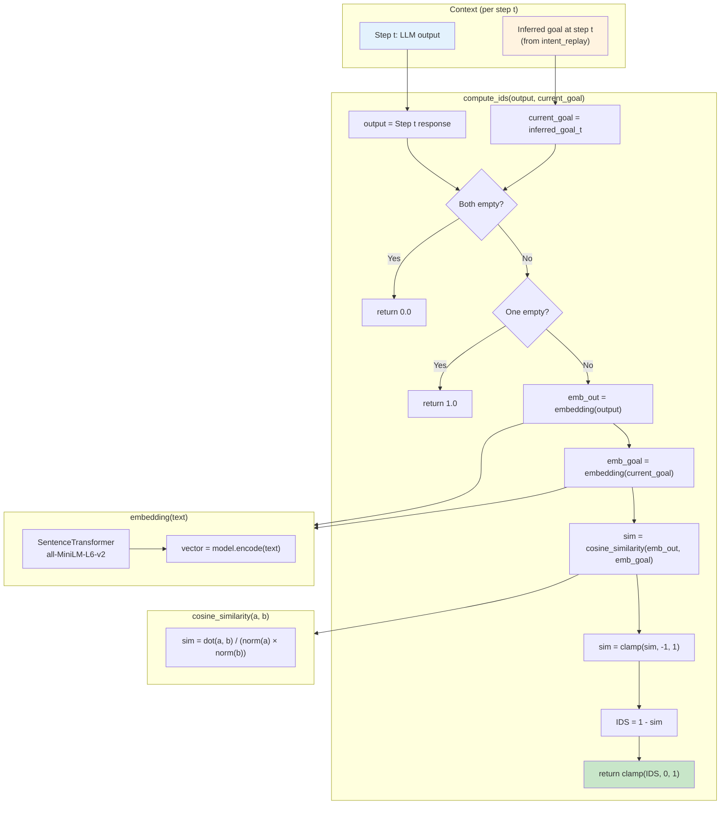
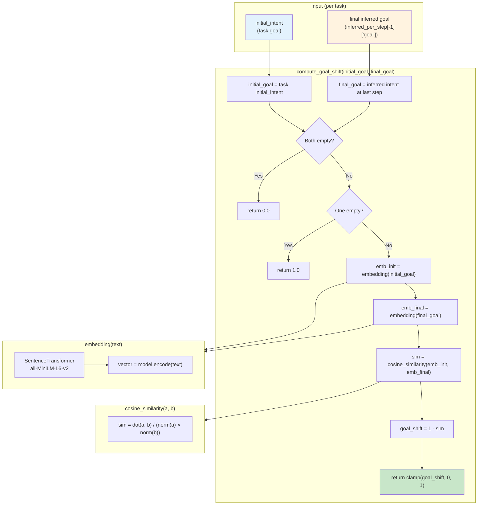

# IDS and Goal Shift — Calculation Flowchart

## Primary: IDS (Intent Drift Score)

Per-step divergence of **model output** from the **current inferred goal** (from intent_replay). This is the **Intent Drift Score (IDS)**.

**Formula:** `IDS_t = 1 - cosine_similarity(embedding(output_t), embedding(inferred_goal_t))`

- **IDS = 0** → output aligned with current inferred goal  
- **IDS = 1** → maximum drift from current goal  

Inferred goal at each step comes from **intent_replay(initial_intent, steps)** (same thresholds as the intent agent).

---

## Secondary: Goal shift (task-level cumulative goal shift)

Task-level measure of **user-led** change from initial to final intent.

**Formula:** `goal_shift = 1 - cosine_similarity(embedding(initial_goal), embedding(final_goal))`

- **goal_shift = 0** → no cumulative goal shift (final intent same as initial)  
- **goal_shift = 1** → maximum cumulative shift  

Same for both baseline and intent agents (task-defined initial and final inferred goal).

---

## Aggregation (per task)

| Metric   | Formula |
|----------|---------|
| **mean IDS** | mean(IDS_1, IDS_2, ..., IDS_N) — steps 1..N only |
| **max IDS**  | max(IDS_1, ..., IDS_N) |
| **goal_shift** | One value per task (initial vs final inferred goal) |

Step 0 can have IDS computed vs inferred goal at step 0; reporting typically uses steps 1..N for mean/max IDS.
