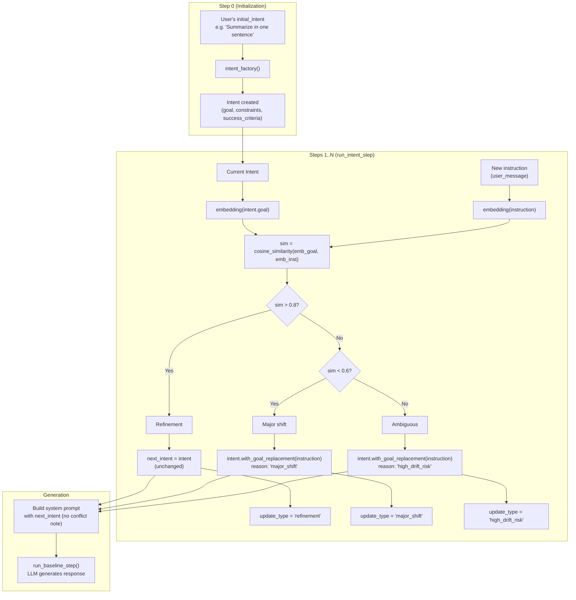

# Intent Fusion Engine — Update Flowchart

Inverted logic: **sim > 0.8 → keep**; **sim < 0.6 → replace goal**; **0.6 ≤ sim ≤ 0.8 → replace + log high_drift_risk**. No blocking; current intent is always sent to the model.

Note: `next_intent` becomes the current intent for the next step. The LLM always receives the current intent; there is no conflict block or refusal path.

## Summary

| Condition       | Intent update                         | update_type       |
|----------------|---------------------------------------|-------------------|
| **sim > 0.8**  | Keep (no change)                      | `refinement`      |
| **sim < 0.6**  | Replace goal via `with_goal_replacement(instruction)`, append to update_history with reason `major_shift` | `major_shift`     |
| **0.6 ≤ sim ≤ 0.8** | Replace goal via `with_goal_replacement(instruction)`, append with reason `high_drift_risk` | `high_drift_risk` |

## with_goal_replacement(new_goal)

- Replaces `goal` with `new_goal`.
- Re-derives `constraints` and `success_criteria` via `derive_constraints_from_goal(new_goal)`.
- Bumps `version` by 1.
- Optionally appends an entry to `update_history` (e.g. `{ old_goal, new_goal, reason }`).

## Thresholds

- **HIGH_THRESHOLD = 0.8**: Above → refinement; keep intent.
- **LOW_THRESHOLD = 0.6**: Below → major shift; replace goal.
- **Between 0.6 and 0.8**: Update goal and log as high_drift_risk.

## intent_replay

The same logic is replayed over the instruction sequence (without running the LLM) to obtain **inferred intent per step** for IDS and goal_shift computation during interpretation.
