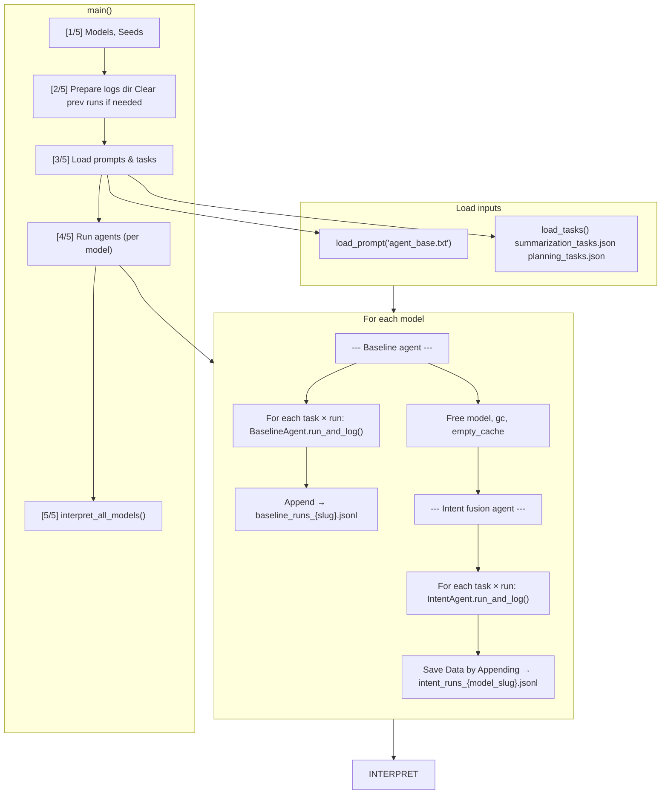

# run_experiment.py — Data Flow

## Step-by-step

| Step | Action |
|------|--------|
| 1 | Models list + seeds (42, 43, 44) |
| 2 | Create `logs/`, clear previous run logs for models being run |
| 3 | Load `agent_base.txt`, `summarization_tasks.json`, `planning_tasks.json` |
| 4 | For each model (if logs missing): run BaselineAgent then IntentAgent, append to JSONL |
| 5 | `interpret_all_models()`: load JSONL → per-model interpretation → cross-model viz → overall report |

## Outputs

| Path | Content |
|------|---------|
| `logs/baseline_runs_{slug}.jsonl` | Per-step baseline logs (task_id, step, output, ids) |
| `logs/intent_runs_{slug}.jsonl` | Per-step intent logs |
| `logs/{slug}/` | Per-model CSVs, PNGs, experiment_report.md |
| `logs/` | Cross-model PNGs, cross_model_summary.csv, experiment_report.md |
