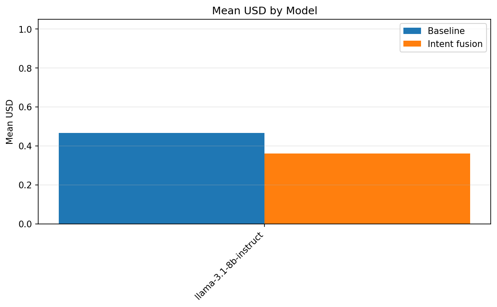
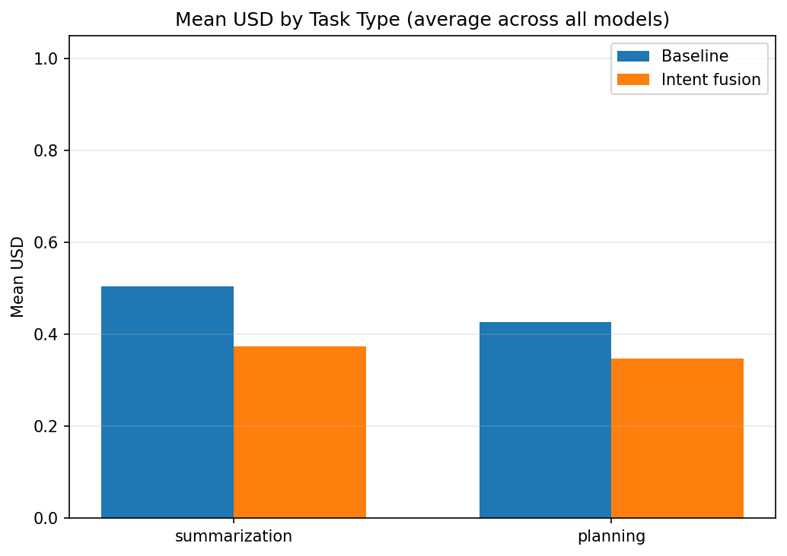
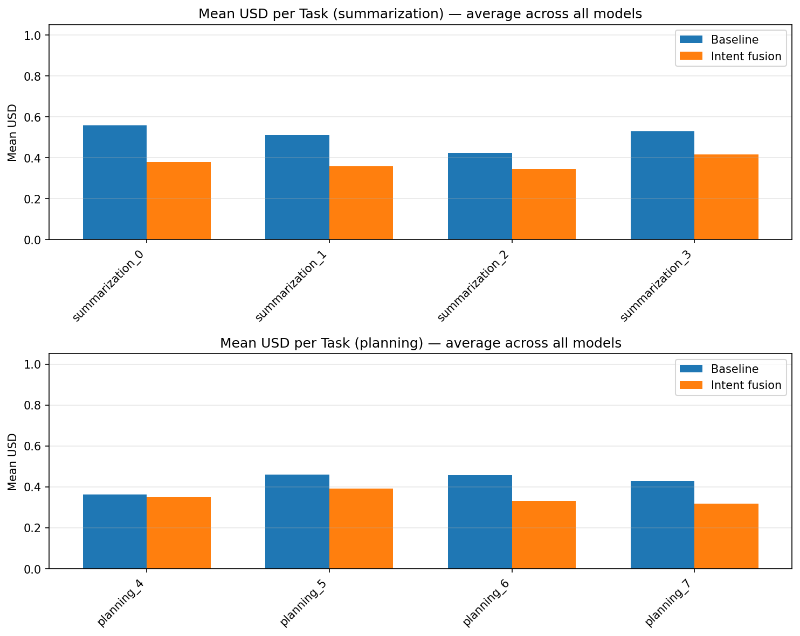
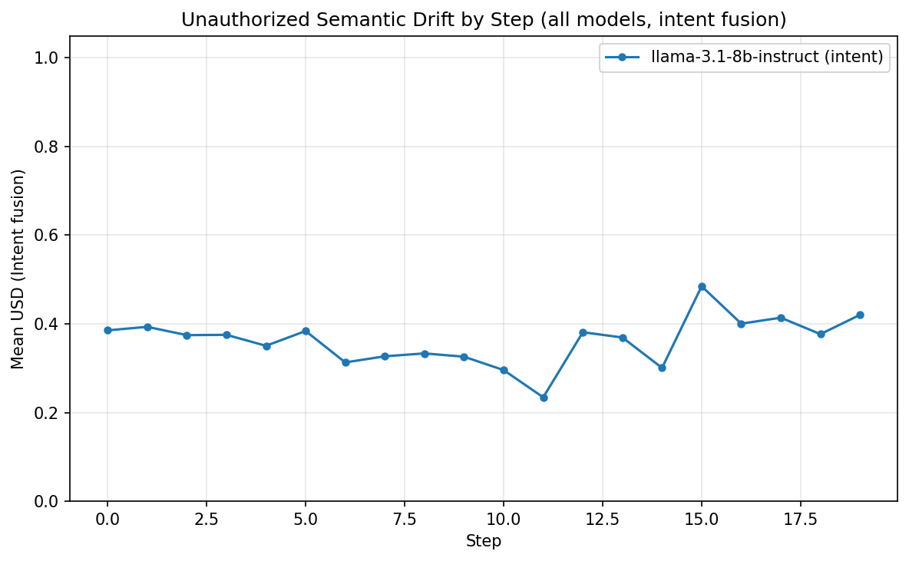
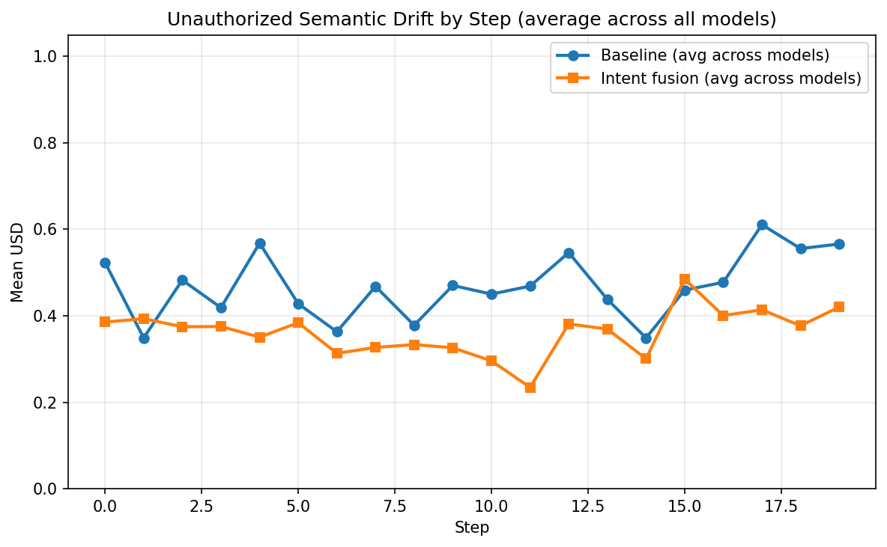
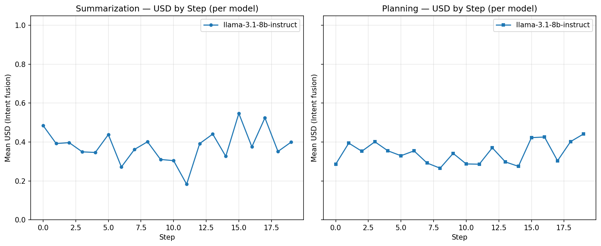

# Intent Drift Experiment Report (Overall)

Generated: 2026-02-09 01:59:19 UTC

Aggregates all models: llama-3.1-8b-instruct.

## Primary: USD (Unauthorized Semantic Drift)

- **0** = aligned with current goal
- **1** = maximum drift. Lower is better.

## Secondary: IDS (task-level cumulative goal shift)

## Summary

| Scope | Baseline mean USD | Intent mean USD | Intent wins | Total |
|-------|-------------------|-----------------|-------------|-------|
| overall | 0.4656 | 0.3608 | 8 | 8 |
| summarization | 0.5049 | 0.3743 | 4 | 4 |
| planning | 0.4262 | 0.3472 | 4 | 4 |

**Intent fusion had lower mean USD in 8/8 task-model pairs.**

## Statistical Significance (Overall)

- **Pooled paired tests** (all models × unique tasks, n=8 pairs).
- **Paired t-test** (H0: mean difference = 0): p = 6.9668e-04.
- **Wilcoxon signed-rank** (non-parametric): p = 7.8125e-03.
- **Cohen's d** (paired; negative = intent lower USD): d = -2.034.
- Interpret: p < 0.05 suggests the mean IDS difference is unlikely due to chance; |d| ~ 0.2 small, ~0.5 medium, ~0.8+ large.

## Per-Model Reports

- [llama-3.1-8b-instruct](llama-3.1-8b-instruct/experiment_report.md)

## Graphs

