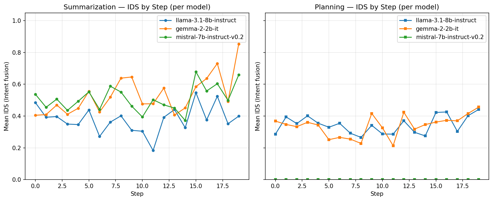

# Intent Drift Experiment Report (Overall)

Generated: 2026-02-09 08:14:55 UTC

Aggregates all models: llama-3.1-8b-instruct, gemma-2-2b-it, mistral-7b-instruct-v0.2.

## Primary: IDS (Intent Drift Score)

- **0** = aligned with current goal
- **1** = maximum drift. Lower is better.

## Secondary: Goal shift (task-level cumulative goal shift)

## Summary

| Scope | Baseline mean IDS | Intent mean IDS | Intent wins | Total |
|-------|-------------------|-----------------|-------------|-------|
| overall | 0.4673 | 0.4210 | 16 | 20 |
| summarization | 0.4995 | 0.4735 | 8 | 12 |
| planning | 0.4189 | 0.3421 | 8 | 8 |

**Intent fusion had lower mean IDS in 16/20 task-model pairs.**

## Statistical Significance (Overall)

- **Pooled paired tests** (all models × unique tasks, n=20 pairs).
- **Paired t-test** (H0: mean difference = 0): p = 1.9356e-03.
- **Wilcoxon signed-rank** (non-parametric): p = 2.7122e-03.
- **Cohen's d** (paired; negative = intent lower IDS): d = -0.804.
- Interpret: p < 0.05 suggests the mean IDS difference is unlikely due to chance; |d| ~ 0.2 small, ~0.5 medium, ~0.8+ large.

## Per-Model Reports

- [llama-3.1-8b-instruct](llama-3.1-8b-instruct/experiment_report.md)
- [gemma-2-2b-it](gemma-2-2b-it/experiment_report.md)
- [mistral-7b-instruct-v0.2](mistral-7b-instruct-v0.2/experiment_report.md)

## Graphs

