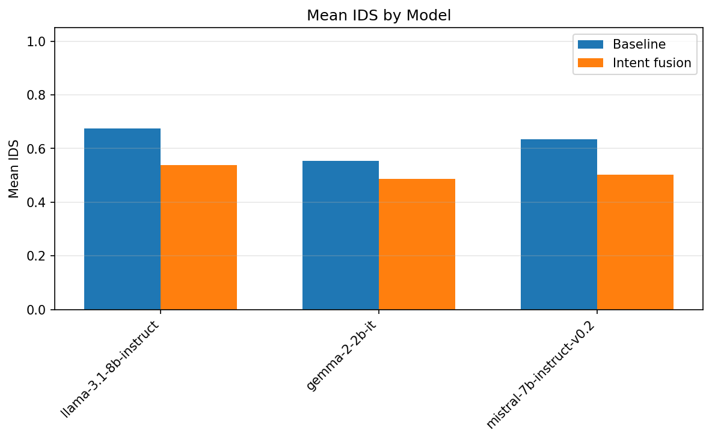
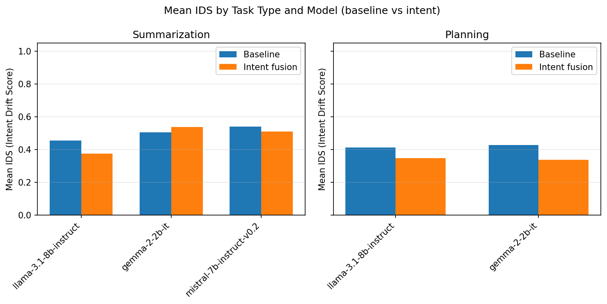
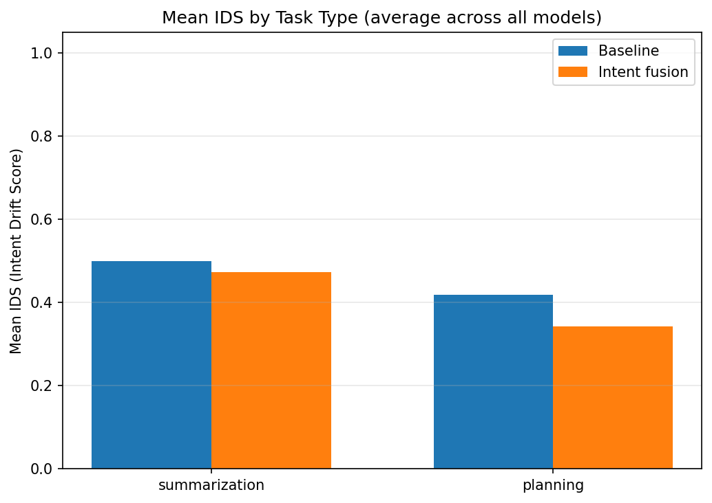
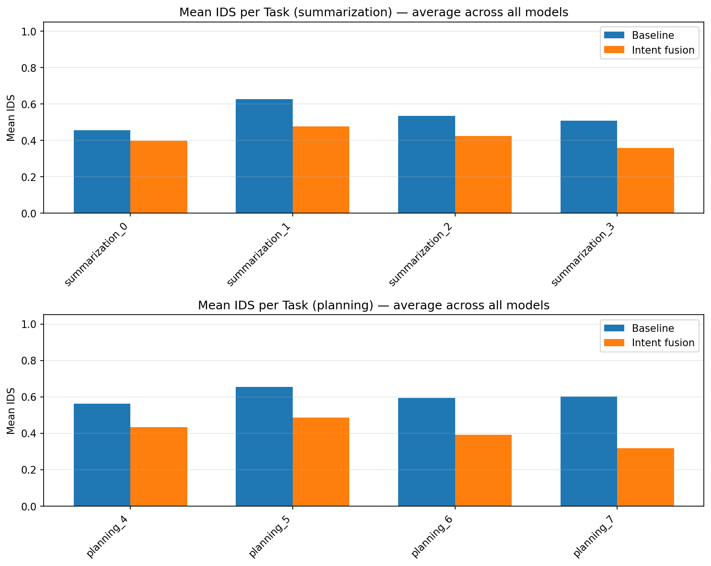
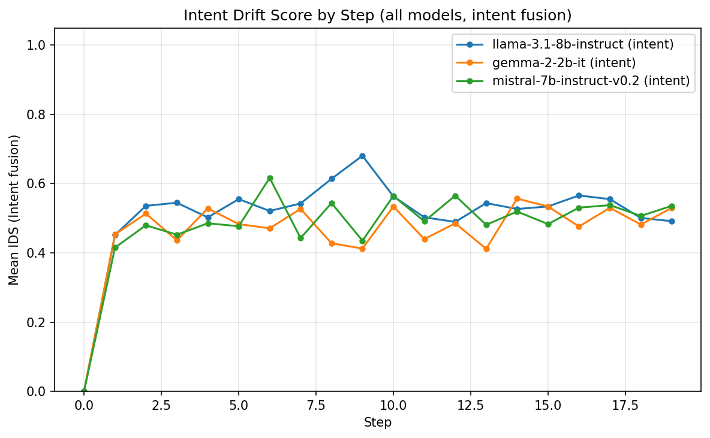
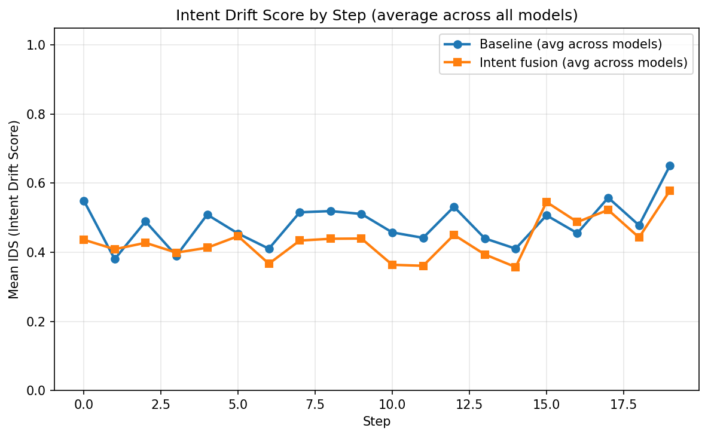

# Intent Drift Experiment Report (Overall)

Generated: 2026-02-08 02:28:22 UTC

Aggregates all models: llama-3.1-8b-instruct, gemma-2-2b-it.

## Intent Drift Score (IDS)

- **0** = aligned with initial intent
- **1** = maximum semantic drift
- Lower is better.

## Summary

| Scope | Baseline mean IDS | Intent mean IDS | Intent wins | Total |
|-------|-------------------|-----------------|-------------|-------|
| overall | 0.5666 | 0.4105 | 15 | 16 |
| summarization | 0.5301 | 0.4135 | 7 | 8 |
| planning | 0.6031 | 0.4074 | 8 | 8 |

**Intent fusion had lower mean IDS in 15/16 task-model pairs.**

## Statistical Significance (Overall)

- **Pooled paired tests** (all models × unique tasks, n=16 pairs).
- **Paired t-test** (H0: mean difference = 0): p = 9.7740e-06.
- **Wilcoxon signed-rank** (non-parametric): p = 9.1553e-05.
- **Cohen's d** (paired; negative = intent lower IDS): d = -1.629.
- Interpret: p < 0.05 suggests the mean IDS difference is unlikely due to chance; |d| ~ 0.2 small, ~0.5 medium, ~0.8+ large.

## Per-Model Reports

- [llama-3.1-8b-instruct](llama-3.1-8b-instruct/experiment_report.md)
- [gemma-2-2b-it](gemma-2-2b-it/experiment_report.md)

## Graphs

