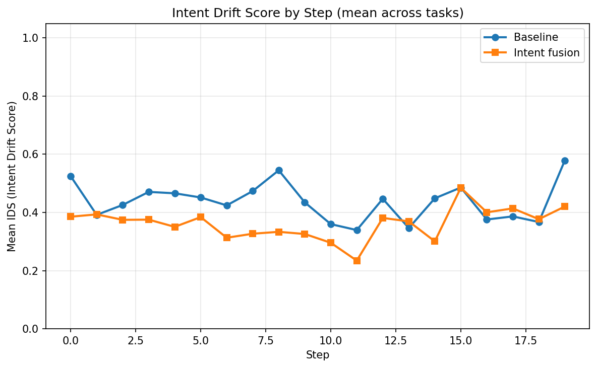
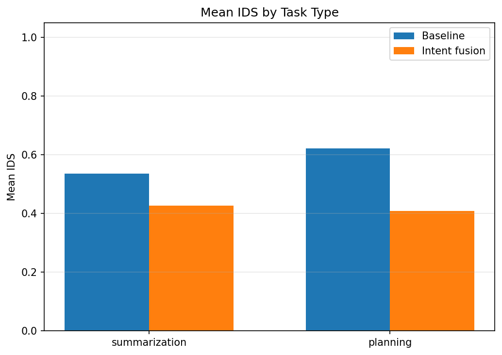
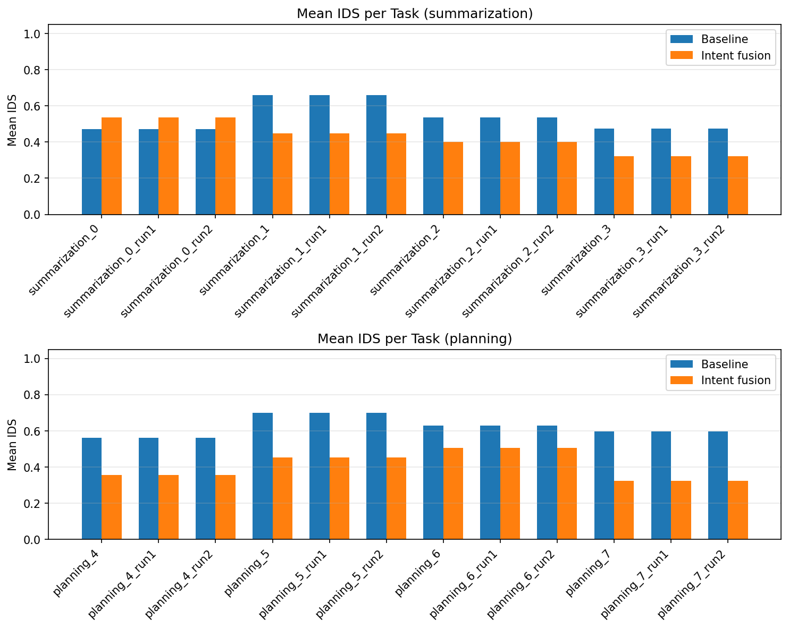

# Intent Drift Experiment Report

Generated: 2026-02-08 02:28:21 UTC

## Intent Drift Score (IDS)

- **0** = aligned with initial intent
- **1** = maximum semantic drift
- Lower is better.

## Summary

| Scope | Baseline mean IDS | Intent mean IDS | Intent wins | Total tasks |
|-------|-------------------|-----------------|-------------|-------------|
| overall | 0.5788 | 0.4179 | 21 | 24 |
| summarization | 0.5356 | 0.4266 | 9 | 12 |
| planning | 0.6220 | 0.4092 | 12 | 12 |

**Intent fusion had lower mean IDS in 21/24 tasks.**

## Statistical significance

- **Paired tests** (same task under baseline vs intent, n=24 tasks).
- **Paired t-test** (H0: mean difference = 0): p = 0.0000.
- **Wilcoxon signed-rank** (non-parametric): p = 0.0000.
- **Cohen's d** (paired; negative = intent lower IDS): d = -1.604.
- Interpret: p < 0.05 suggests the mean IDS difference is unlikely due to chance; |d| ~ 0.2 small, ~0.5 medium, ~0.8+ large.

## Task-Level Comparison

| task_id | task_type | baseline_mean | intent_mean | delta | winner |
|---------|-----------|---------------|-------------|-------|--------|
| planning_4_run0 | planning | 0.5629 | 0.3546 | -0.2083 | intent |
| planning_4_run1 | planning | 0.5629 | 0.3546 | -0.2083 | intent |
| planning_4_run2 | planning | 0.5629 | 0.3546 | -0.2083 | intent |
| planning_5_run0 | planning | 0.6992 | 0.4530 | -0.2462 | intent |
| planning_5_run1 | planning | 0.6992 | 0.4530 | -0.2462 | intent |
| planning_5_run2 | planning | 0.6992 | 0.4530 | -0.2462 | intent |
| planning_6_run0 | planning | 0.6277 | 0.5052 | -0.1225 | intent |
| planning_6_run1 | planning | 0.6277 | 0.5052 | -0.1225 | intent |
| planning_6_run2 | planning | 0.6277 | 0.5052 | -0.1225 | intent |
| planning_7_run0 | planning | 0.5981 | 0.3241 | -0.2740 | intent |
| planning_7_run1 | planning | 0.5981 | 0.3241 | -0.2740 | intent |
| planning_7_run2 | planning | 0.5981 | 0.3241 | -0.2740 | intent |
| summarization_0_run0 | summarization | 0.4724 | 0.5348 | +0.0624 | baseline |
| summarization_0_run1 | summarization | 0.4724 | 0.5348 | +0.0624 | baseline |
| summarization_0_run2 | summarization | 0.4724 | 0.5348 | +0.0624 | baseline |
| summarization_1_run0 | summarization | 0.6604 | 0.4477 | -0.2127 | intent |
| summarization_1_run1 | summarization | 0.6604 | 0.4477 | -0.2127 | intent |
| summarization_1_run2 | summarization | 0.6604 | 0.4477 | -0.2127 | intent |
| summarization_2_run0 | summarization | 0.5368 | 0.4015 | -0.1353 | intent |
| summarization_2_run1 | summarization | 0.5368 | 0.4015 | -0.1353 | intent |
| summarization_2_run2 | summarization | 0.5368 | 0.4015 | -0.1353 | intent |
| summarization_3_run0 | summarization | 0.4729 | 0.3226 | -0.1502 | intent |
| summarization_3_run1 | summarization | 0.4729 | 0.3226 | -0.1502 | intent |
| summarization_3_run2 | summarization | 0.4729 | 0.3226 | -0.1502 | intent |

## Graphs

