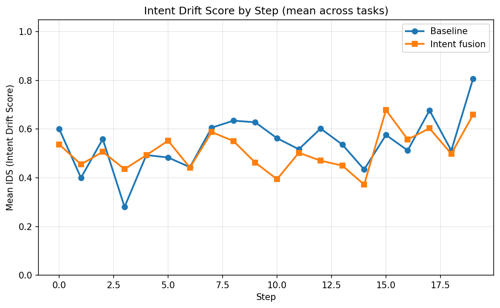
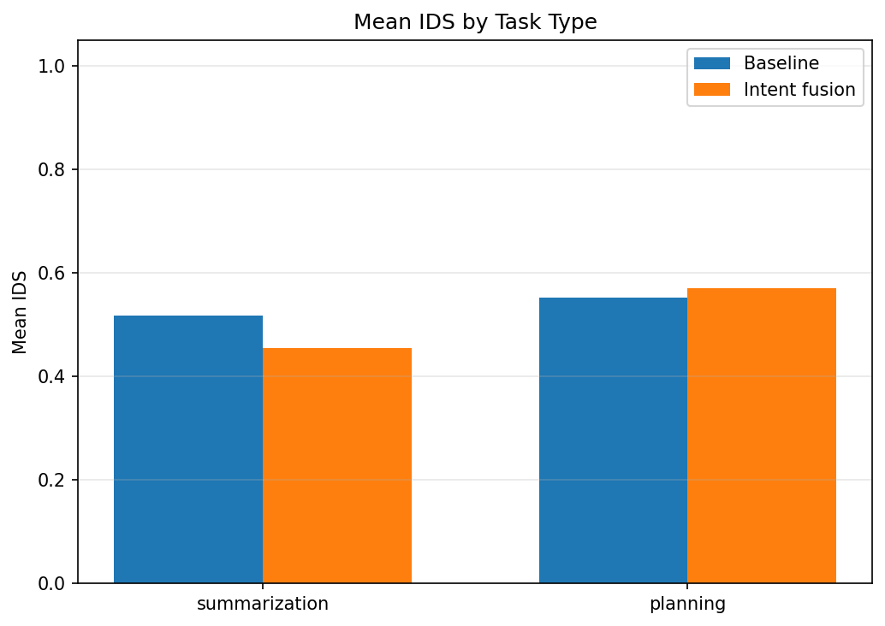
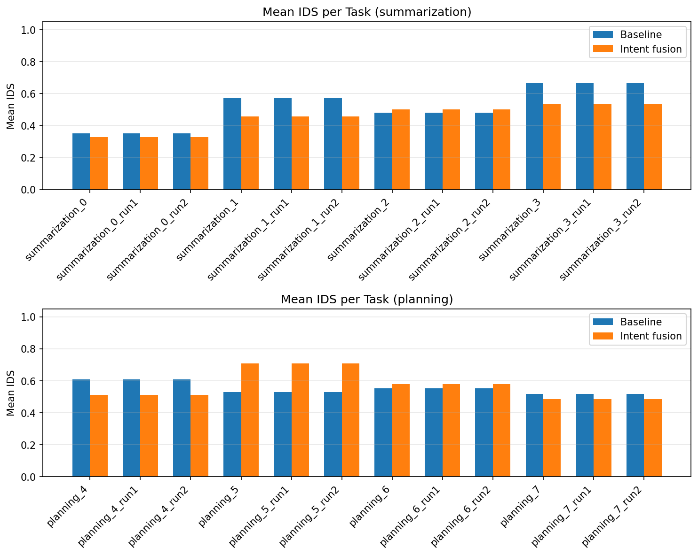

# Intent Drift Experiment Report

Generated: 2026-02-07 18:58:38 UTC

## Intent Drift Score (IDS)

- **0** = aligned with initial intent
- **1** = maximum semantic drift
- Lower is better.

## Summary

| Scope | Baseline mean IDS | Intent mean IDS | Intent wins | Total tasks |
|-------|-------------------|-----------------|-------------|-------------|
| overall | 0.5346 | 0.5130 | 15 | 24 |
| summarization | 0.5167 | 0.4548 | 9 | 12 |
| planning | 0.5526 | 0.5711 | 6 | 12 |

**Intent fusion had lower mean IDS in 15/24 tasks.**

## Statistical significance

- **Paired tests** (same task under baseline vs intent, n=24 tasks).
- **Paired t-test** (H0: mean difference = 0): p = 0.2812.
- **Wilcoxon signed-rank** (non-parametric): p = 0.1515.
- **Cohen's d** (paired; negative = intent lower IDS): d = -0.225.
- Interpret: p < 0.05 suggests the mean IDS difference is unlikely due to chance; |d| ~ 0.2 small, ~0.5 medium, ~0.8+ large.

## Task-Level Comparison

| task_id | task_type | baseline_mean | intent_mean | delta | winner |
|---------|-----------|---------------|-------------|-------|--------|
| planning_4_run0 | planning | 0.6098 | 0.5117 | -0.0981 | intent |
| planning_4_run1 | planning | 0.6098 | 0.5117 | -0.0981 | intent |
| planning_4_run2 | planning | 0.6098 | 0.5117 | -0.0981 | intent |
| planning_5_run0 | planning | 0.5294 | 0.7095 | +0.1801 | baseline |
| planning_5_run1 | planning | 0.5294 | 0.7095 | +0.1801 | baseline |
| planning_5_run2 | planning | 0.5294 | 0.7095 | +0.1801 | baseline |
| planning_6_run0 | planning | 0.5538 | 0.5780 | +0.0242 | baseline |
| planning_6_run1 | planning | 0.5538 | 0.5780 | +0.0242 | baseline |
| planning_6_run2 | planning | 0.5538 | 0.5780 | +0.0242 | baseline |
| planning_7_run0 | planning | 0.5173 | 0.4851 | -0.0321 | intent |
| planning_7_run1 | planning | 0.5173 | 0.4851 | -0.0321 | intent |
| planning_7_run2 | planning | 0.5173 | 0.4851 | -0.0321 | intent |
| summarization_0_run0 | summarization | 0.3516 | 0.3288 | -0.0227 | intent |
| summarization_0_run1 | summarization | 0.3516 | 0.3288 | -0.0227 | intent |
| summarization_0_run2 | summarization | 0.3516 | 0.3288 | -0.0227 | intent |
| summarization_1_run0 | summarization | 0.5702 | 0.4575 | -0.1127 | intent |
| summarization_1_run1 | summarization | 0.5702 | 0.4575 | -0.1127 | intent |
| summarization_1_run2 | summarization | 0.5702 | 0.4575 | -0.1127 | intent |
| summarization_2_run0 | summarization | 0.4796 | 0.4999 | +0.0202 | baseline |
| summarization_2_run1 | summarization | 0.4796 | 0.4999 | +0.0202 | baseline |
| summarization_2_run2 | summarization | 0.4796 | 0.4999 | +0.0202 | baseline |
| summarization_3_run0 | summarization | 0.6654 | 0.5331 | -0.1324 | intent |
| summarization_3_run1 | summarization | 0.6654 | 0.5331 | -0.1324 | intent |
| summarization_3_run2 | summarization | 0.6654 | 0.5331 | -0.1324 | intent |

## Graphs

