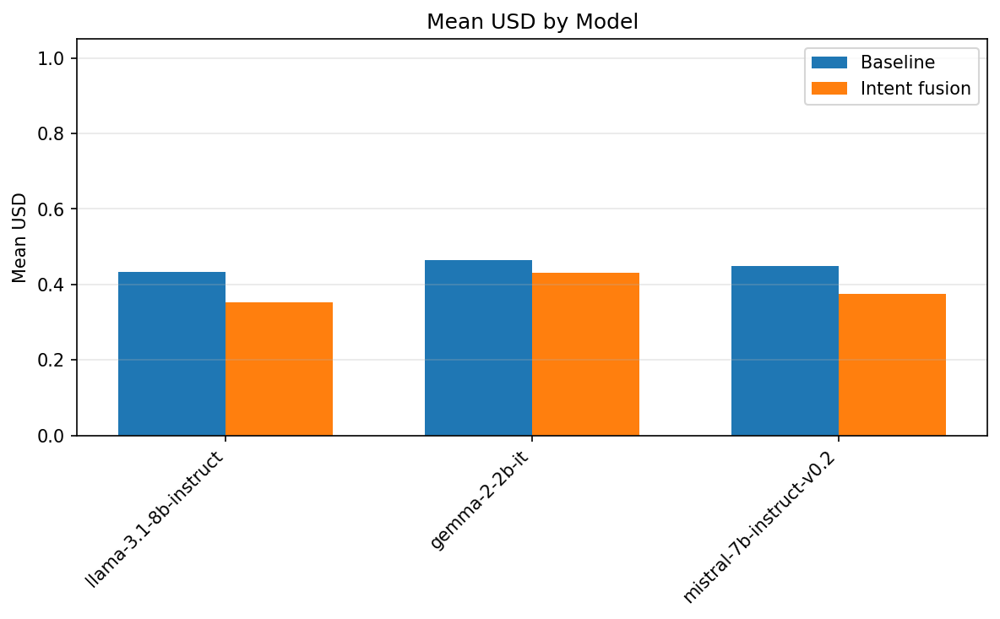
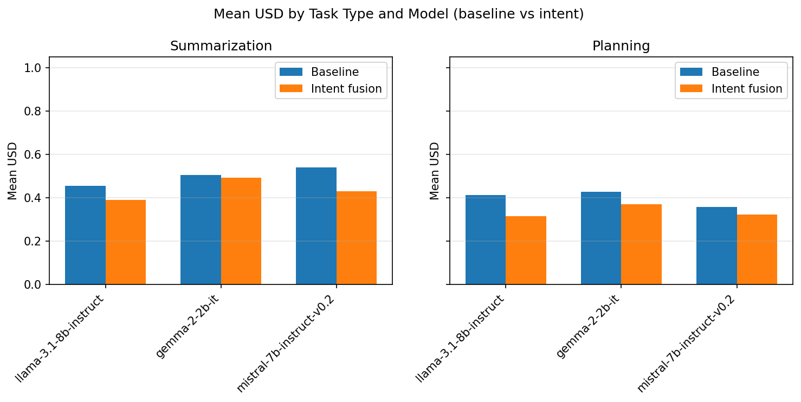
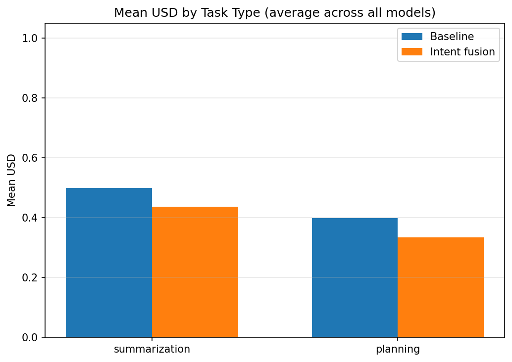
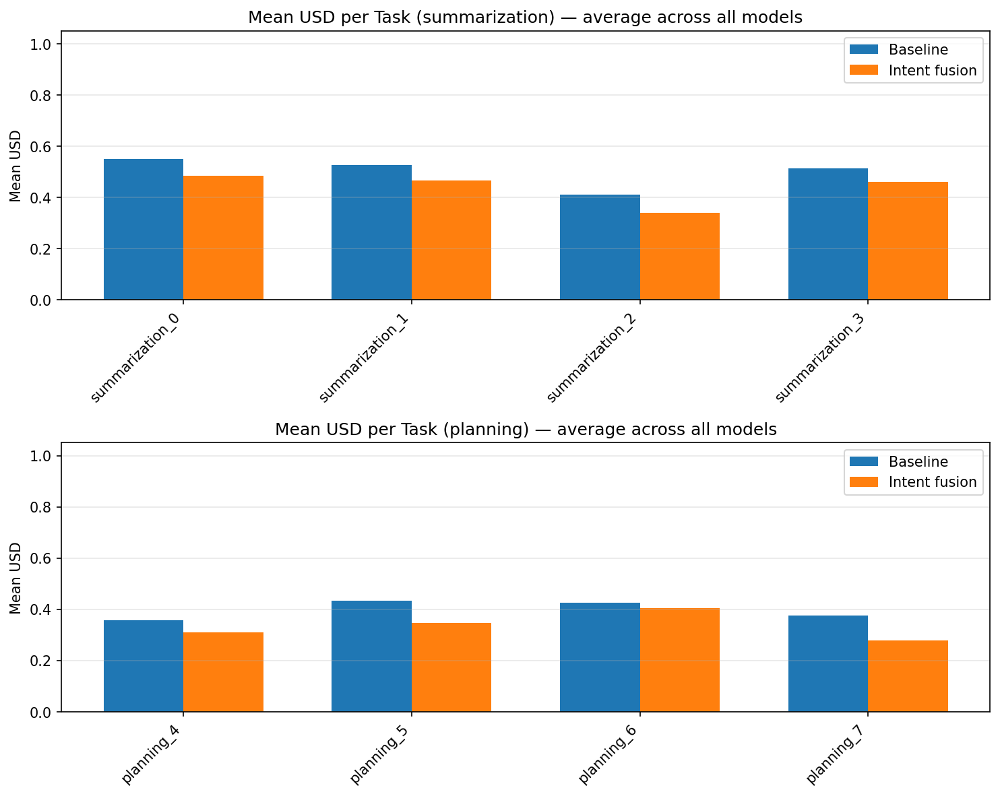
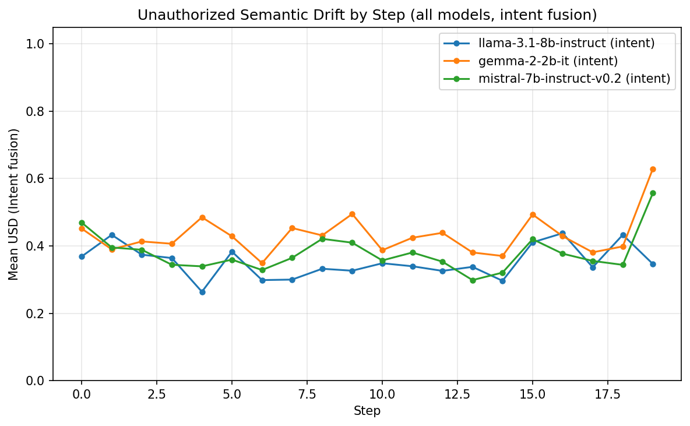
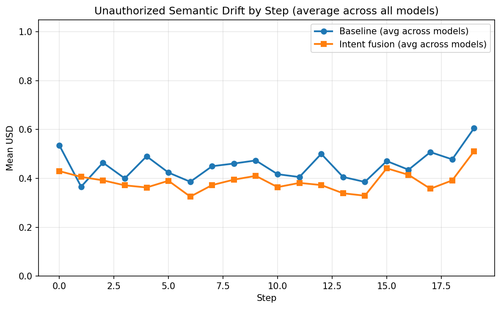
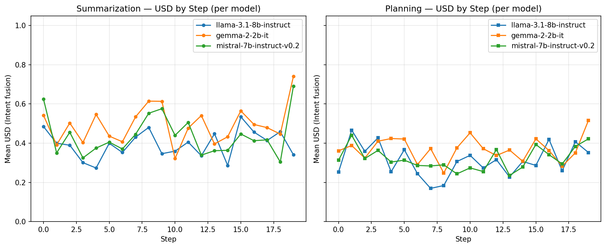

# Intent Drift Experiment Report (Overall)

Generated: 2026-02-08 20:45:02 UTC

Aggregates all models: llama-3.1-8b-instruct, gemma-2-2b-it, mistral-7b-instruct-v0.2.

## Primary: USD (Unauthorized Semantic Drift)

- **0** = aligned with current goal
- **1** = maximum drift. Lower is better.

## Secondary: IDS (task-level cumulative goal shift)

## Summary

| Scope | Baseline mean USD | Intent mean USD | Intent wins | Total |
|-------|-------------------|-----------------|-------------|-------|
| overall | 0.4488 | 0.3857 | 20 | 24 |
| summarization | 0.4995 | 0.4368 | 10 | 12 |
| planning | 0.3980 | 0.3347 | 10 | 12 |

**Intent fusion had lower mean USD in 20/24 task-model pairs.**

## Statistical Significance (Overall)

- **Pooled paired tests** (all models × unique tasks, n=24 pairs).
- **Paired t-test** (H0: mean difference = 0): p = 7.1891e-07.
- **Wilcoxon signed-rank** (non-parametric): p = 6.5565e-06.
- **Cohen's d** (paired; negative = intent lower USD): d = -1.375.
- Interpret: p < 0.05 suggests the mean IDS difference is unlikely due to chance; |d| ~ 0.2 small, ~0.5 medium, ~0.8+ large.

## Per-Model Reports

- [llama-3.1-8b-instruct](llama-3.1-8b-instruct/experiment_report.md)
- [gemma-2-2b-it](gemma-2-2b-it/experiment_report.md)
- [mistral-7b-instruct-v0.2](mistral-7b-instruct-v0.2/experiment_report.md)

## Graphs

