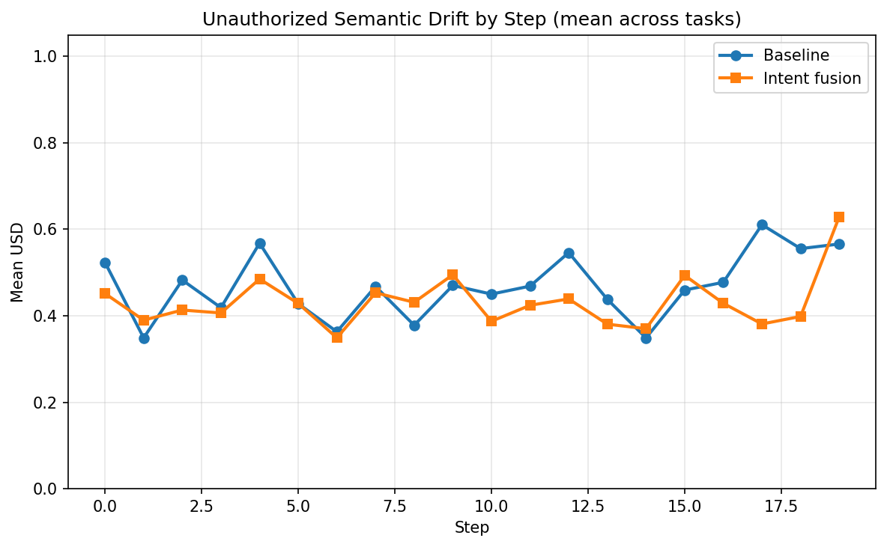
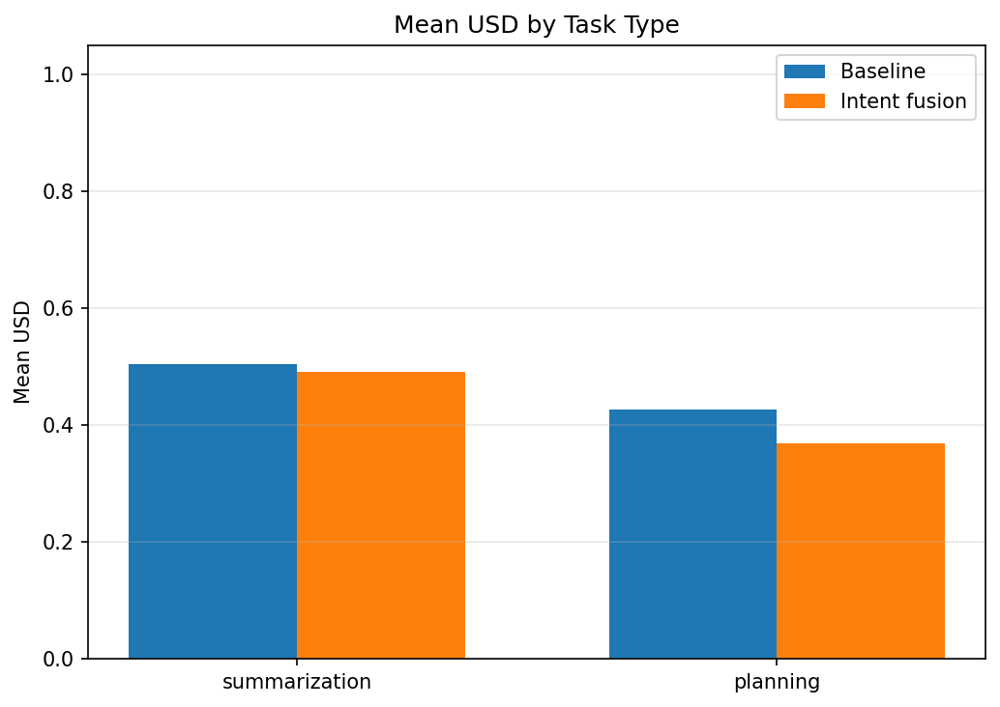
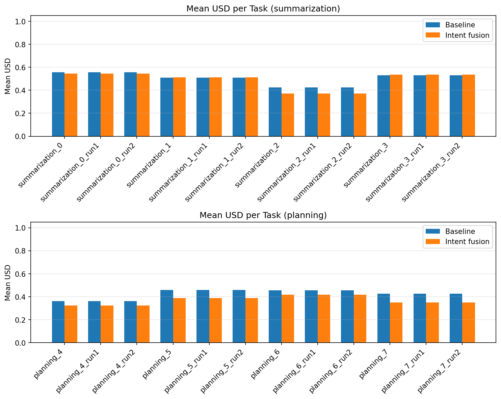

# Intent Drift Experiment Report

Generated: 2026-02-08 20:39:32 UTC

## Primary metric: USD (Unauthorized Semantic Drift)

- Per-step divergence of output from current inferred goal. **0** = aligned, **1** = max drift. Lower is better.

## Secondary metric: IDS (Intent Drift Score)

- Task-level cumulative goal shift (initial vs final intent). Lower is better.

## Summary

| Scope | Baseline mean USD | Intent mean USD | Intent wins | Total tasks |
|-------|-------------------|-----------------|-------------|-------------|
| overall | 0.4656 | 0.4307 | 18 | 24 |
| summarization | 0.5049 | 0.4918 | 6 | 12 |
| planning | 0.4262 | 0.3696 | 12 | 12 |

**Intent fusion had lower mean USD in 18/24 tasks.**

## Statistical significance

- **Paired tests** (same task under baseline vs intent, n=24 tasks).
- **Paired t-test** (H0: mean difference = 0): p = 0.0000.
- **Wilcoxon signed-rank** (non-parametric): p = 0.0001.
- **Cohen's d** (paired; negative = intent lower USD): d = -1.138.
- Interpret: p < 0.05 suggests the mean USD difference is unlikely due to chance; |d| ~ 0.2 small, ~0.5 medium, ~0.8+ large.

## Task-Level Comparison

| task_id | task_type | baseline_mean_usd | intent_mean_usd | delta_usd | winner |
|---------|-----------|-------------------|-----------------|-----------|---|
| planning_4_run0 | planning | 0.3619 | 0.3228 | -0.0391 | intent |
| planning_4_run1 | planning | 0.3619 | 0.3228 | -0.0391 | intent |
| planning_4_run2 | planning | 0.3619 | 0.3228 | -0.0391 | intent |
| planning_5_run0 | planning | 0.4590 | 0.3869 | -0.0720 | intent |
| planning_5_run1 | planning | 0.4590 | 0.3869 | -0.0720 | intent |
| planning_5_run2 | planning | 0.4590 | 0.3869 | -0.0720 | intent |
| planning_6_run0 | planning | 0.4562 | 0.4182 | -0.0380 | intent |
| planning_6_run1 | planning | 0.4562 | 0.4182 | -0.0380 | intent |
| planning_6_run2 | planning | 0.4562 | 0.4182 | -0.0380 | intent |
| planning_7_run0 | planning | 0.4278 | 0.3506 | -0.0772 | intent |
| planning_7_run1 | planning | 0.4278 | 0.3506 | -0.0772 | intent |
| planning_7_run2 | planning | 0.4278 | 0.3506 | -0.0772 | intent |
| summarization_0_run0 | summarization | 0.5566 | 0.5457 | -0.0109 | intent |
| summarization_0_run1 | summarization | 0.5566 | 0.5457 | -0.0109 | intent |
| summarization_0_run2 | summarization | 0.5566 | 0.5457 | -0.0109 | intent |
| summarization_1_run0 | summarization | 0.5104 | 0.5136 | +0.0032 | baseline |
| summarization_1_run1 | summarization | 0.5104 | 0.5136 | +0.0032 | baseline |
| summarization_1_run2 | summarization | 0.5104 | 0.5136 | +0.0032 | baseline |
| summarization_2_run0 | summarization | 0.4229 | 0.3718 | -0.0512 | intent |
| summarization_2_run1 | summarization | 0.4229 | 0.3718 | -0.0512 | intent |
| summarization_2_run2 | summarization | 0.4229 | 0.3718 | -0.0512 | intent |
| summarization_3_run0 | summarization | 0.5298 | 0.5362 | +0.0065 | baseline |
| summarization_3_run1 | summarization | 0.5298 | 0.5362 | +0.0065 | baseline |
| summarization_3_run2 | summarization | 0.5298 | 0.5362 | +0.0065 | baseline |

## Graphs

