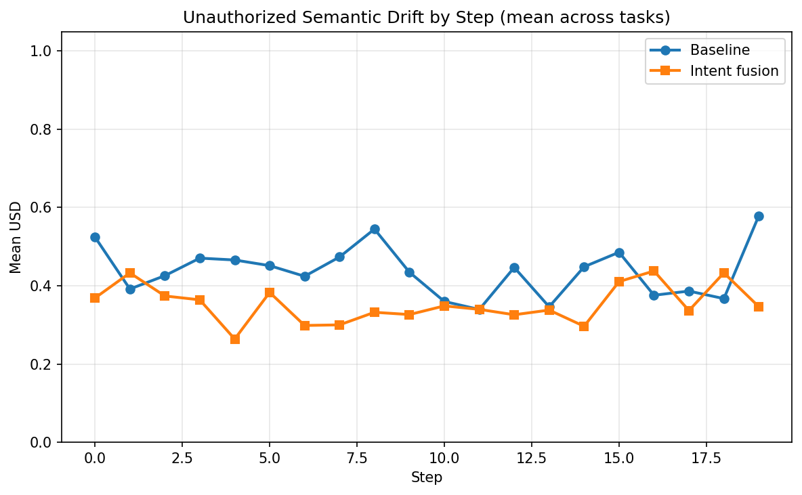
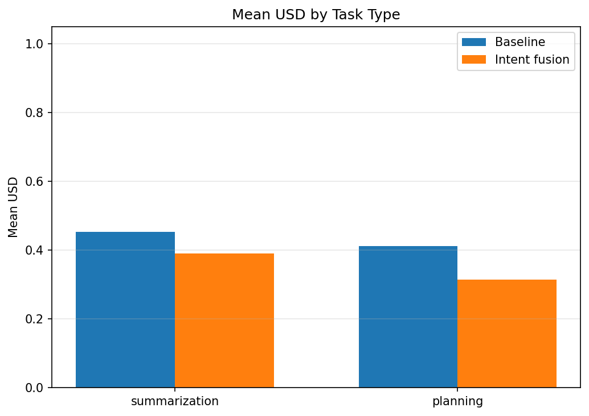
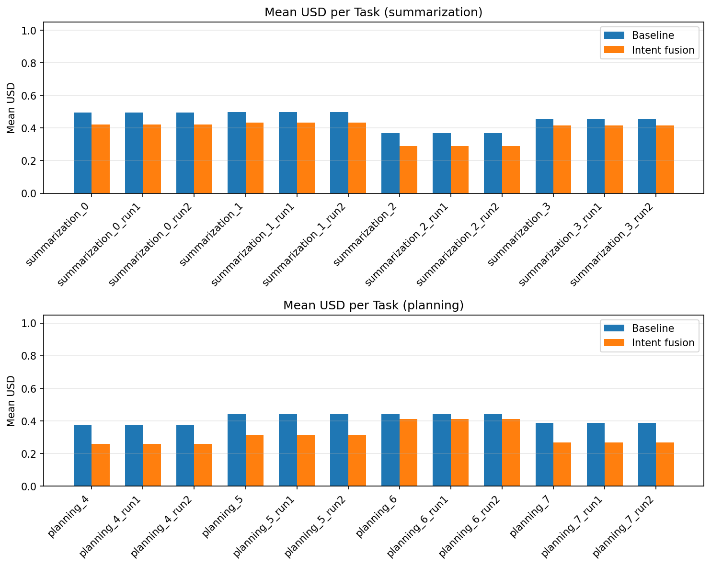

# Intent Drift Experiment Report

Generated: 2026-02-08 20:35:58 UTC

## Primary metric: USD (Unauthorized Semantic Drift)

- Per-step divergence of output from current inferred goal. **0** = aligned, **1** = max drift. Lower is better.

## Secondary metric: IDS (Intent Drift Score)

- Task-level cumulative goal shift (initial vs final intent). Lower is better.

## Summary

| Scope | Baseline mean USD | Intent mean USD | Intent wins | Total tasks |
|-------|-------------------|-----------------|-------------|-------------|
| overall | 0.4325 | 0.3520 | 24 | 24 |
| summarization | 0.4534 | 0.3901 | 12 | 12 |
| planning | 0.4116 | 0.3139 | 12 | 12 |

**Intent fusion had lower mean USD in 24/24 tasks.**

## Statistical significance

- **Paired tests** (same task under baseline vs intent, n=24 tasks).
- **Paired t-test** (H0: mean difference = 0): p = 0.0000.
- **Wilcoxon signed-rank** (non-parametric): p = 0.0000.
- **Cohen's d** (paired; negative = intent lower USD): d = -2.231.
- Interpret: p < 0.05 suggests the mean USD difference is unlikely due to chance; |d| ~ 0.2 small, ~0.5 medium, ~0.8+ large.

## Task-Level Comparison

| task_id | task_type | baseline_mean_usd | intent_mean_usd | delta_usd | winner |
|---------|-----------|-------------------|-----------------|-----------|---|
| planning_4_run0 | planning | 0.3774 | 0.2583 | -0.1191 | intent |
| planning_4_run1 | planning | 0.3774 | 0.2583 | -0.1191 | intent |
| planning_4_run2 | planning | 0.3774 | 0.2583 | -0.1191 | intent |
| planning_5_run0 | planning | 0.4402 | 0.3164 | -0.1239 | intent |
| planning_5_run1 | planning | 0.4402 | 0.3164 | -0.1239 | intent |
| planning_5_run2 | planning | 0.4402 | 0.3164 | -0.1239 | intent |
| planning_6_run0 | planning | 0.4407 | 0.4132 | -0.0274 | intent |
| planning_6_run1 | planning | 0.4407 | 0.4132 | -0.0274 | intent |
| planning_6_run2 | planning | 0.4407 | 0.4132 | -0.0274 | intent |
| planning_7_run0 | planning | 0.3882 | 0.2675 | -0.1207 | intent |
| planning_7_run1 | planning | 0.3882 | 0.2675 | -0.1207 | intent |
| planning_7_run2 | planning | 0.3882 | 0.2675 | -0.1207 | intent |
| summarization_0_run0 | summarization | 0.4935 | 0.4206 | -0.0729 | intent |
| summarization_0_run1 | summarization | 0.4935 | 0.4206 | -0.0729 | intent |
| summarization_0_run2 | summarization | 0.4935 | 0.4206 | -0.0729 | intent |
| summarization_1_run0 | summarization | 0.4978 | 0.4345 | -0.0634 | intent |
| summarization_1_run1 | summarization | 0.4978 | 0.4345 | -0.0634 | intent |
| summarization_1_run2 | summarization | 0.4978 | 0.4345 | -0.0634 | intent |
| summarization_2_run0 | summarization | 0.3698 | 0.2906 | -0.0793 | intent |
| summarization_2_run1 | summarization | 0.3698 | 0.2906 | -0.0793 | intent |
| summarization_2_run2 | summarization | 0.3698 | 0.2906 | -0.0793 | intent |
| summarization_3_run0 | summarization | 0.4524 | 0.4148 | -0.0377 | intent |
| summarization_3_run1 | summarization | 0.4524 | 0.4148 | -0.0377 | intent |
| summarization_3_run2 | summarization | 0.4524 | 0.4148 | -0.0377 | intent |

## Graphs

