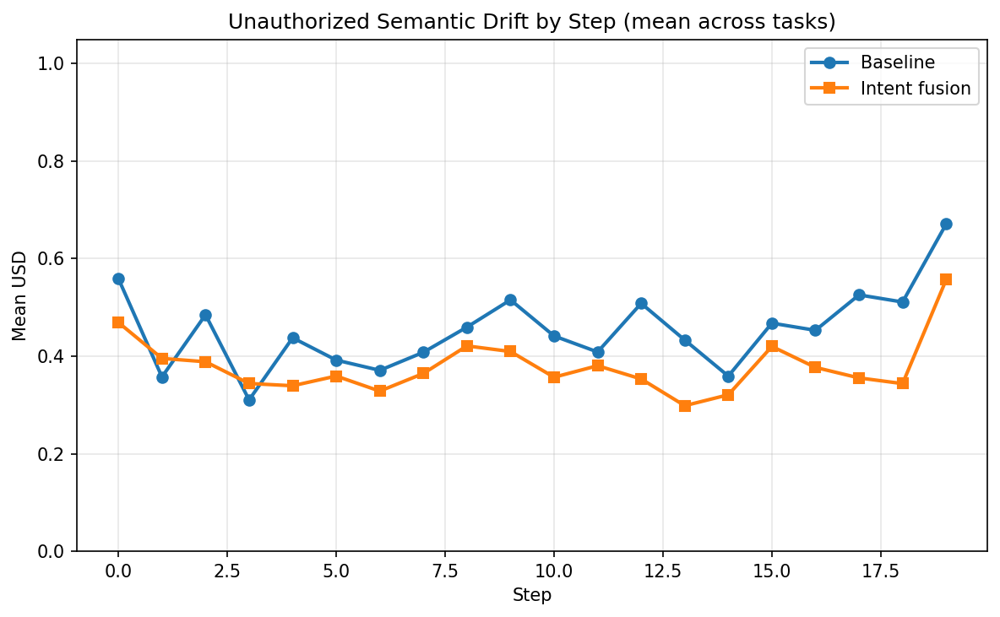
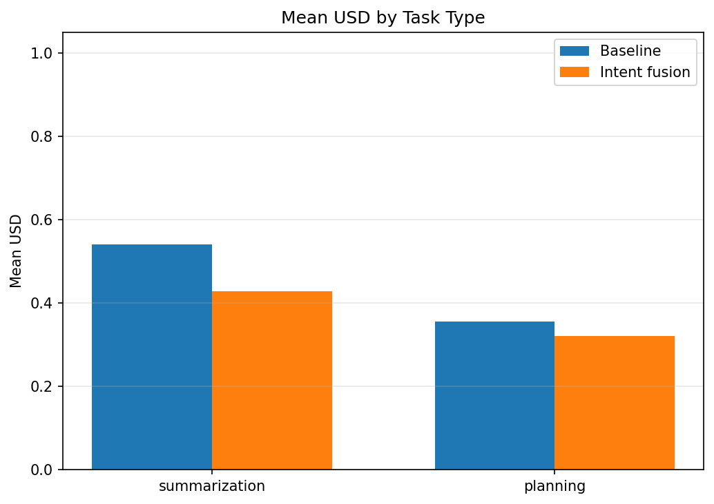
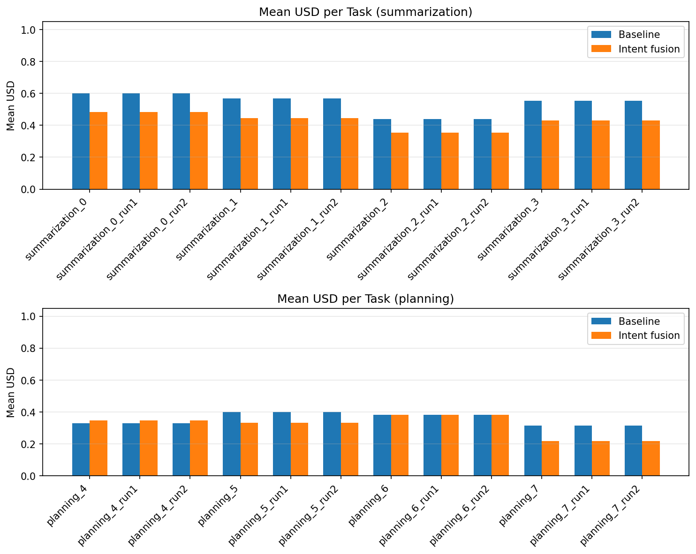

# Intent Drift Experiment Report

Generated: 2026-02-08 20:43:14 UTC

## Primary metric: USD (Unauthorized Semantic Drift)

- Per-step divergence of output from current inferred goal. **0** = aligned, **1** = max drift. Lower is better.

## Secondary metric: IDS (Intent Drift Score)

- Task-level cumulative goal shift (initial vs final intent). Lower is better.

## Summary

| Scope | Baseline mean USD | Intent mean USD | Intent wins | Total tasks |
|-------|-------------------|-----------------|-------------|-------------|
| overall | 0.4482 | 0.3744 | 18 | 24 |
| summarization | 0.5403 | 0.4283 | 12 | 12 |
| planning | 0.3561 | 0.3205 | 6 | 12 |

**Intent fusion had lower mean USD in 18/24 tasks.**

## Statistical significance

- **Paired tests** (same task under baseline vs intent, n=24 tasks).
- **Paired t-test** (H0: mean difference = 0): p = 0.0000.
- **Wilcoxon signed-rank** (non-parametric): p = 0.0001.
- **Cohen's d** (paired; negative = intent lower USD): d = -1.395.
- Interpret: p < 0.05 suggests the mean USD difference is unlikely due to chance; |d| ~ 0.2 small, ~0.5 medium, ~0.8+ large.

## Task-Level Comparison

| task_id | task_type | baseline_mean_usd | intent_mean_usd | delta_usd | winner |
|---------|-----------|-------------------|-----------------|-----------|---|
| planning_4_run0 | planning | 0.3294 | 0.3475 | +0.0181 | baseline |
| planning_4_run1 | planning | 0.3294 | 0.3475 | +0.0181 | baseline |
| planning_4_run2 | planning | 0.3294 | 0.3475 | +0.0181 | baseline |
| planning_5_run0 | planning | 0.3987 | 0.3339 | -0.0648 | intent |
| planning_5_run1 | planning | 0.3987 | 0.3339 | -0.0648 | intent |
| planning_5_run2 | planning | 0.3987 | 0.3339 | -0.0648 | intent |
| planning_6_run0 | planning | 0.3819 | 0.3828 | +0.0009 | baseline |
| planning_6_run1 | planning | 0.3819 | 0.3828 | +0.0009 | baseline |
| planning_6_run2 | planning | 0.3819 | 0.3828 | +0.0009 | baseline |
| planning_7_run0 | planning | 0.3143 | 0.2177 | -0.0965 | intent |
| planning_7_run1 | planning | 0.3143 | 0.2177 | -0.0965 | intent |
| planning_7_run2 | planning | 0.3143 | 0.2177 | -0.0965 | intent |
| summarization_0_run0 | summarization | 0.5992 | 0.4826 | -0.1165 | intent |
| summarization_0_run1 | summarization | 0.5992 | 0.4826 | -0.1165 | intent |
| summarization_0_run2 | summarization | 0.5992 | 0.4826 | -0.1165 | intent |
| summarization_1_run0 | summarization | 0.5680 | 0.4450 | -0.1230 | intent |
| summarization_1_run1 | summarization | 0.5680 | 0.4450 | -0.1230 | intent |
| summarization_1_run2 | summarization | 0.5680 | 0.4450 | -0.1230 | intent |
| summarization_2_run0 | summarization | 0.4397 | 0.3547 | -0.0850 | intent |
| summarization_2_run1 | summarization | 0.4397 | 0.3547 | -0.0850 | intent |
| summarization_2_run2 | summarization | 0.4397 | 0.3547 | -0.0850 | intent |
| summarization_3_run0 | summarization | 0.5545 | 0.4309 | -0.1237 | intent |
| summarization_3_run1 | summarization | 0.5545 | 0.4309 | -0.1237 | intent |
| summarization_3_run2 | summarization | 0.5545 | 0.4309 | -0.1237 | intent |

## Graphs

