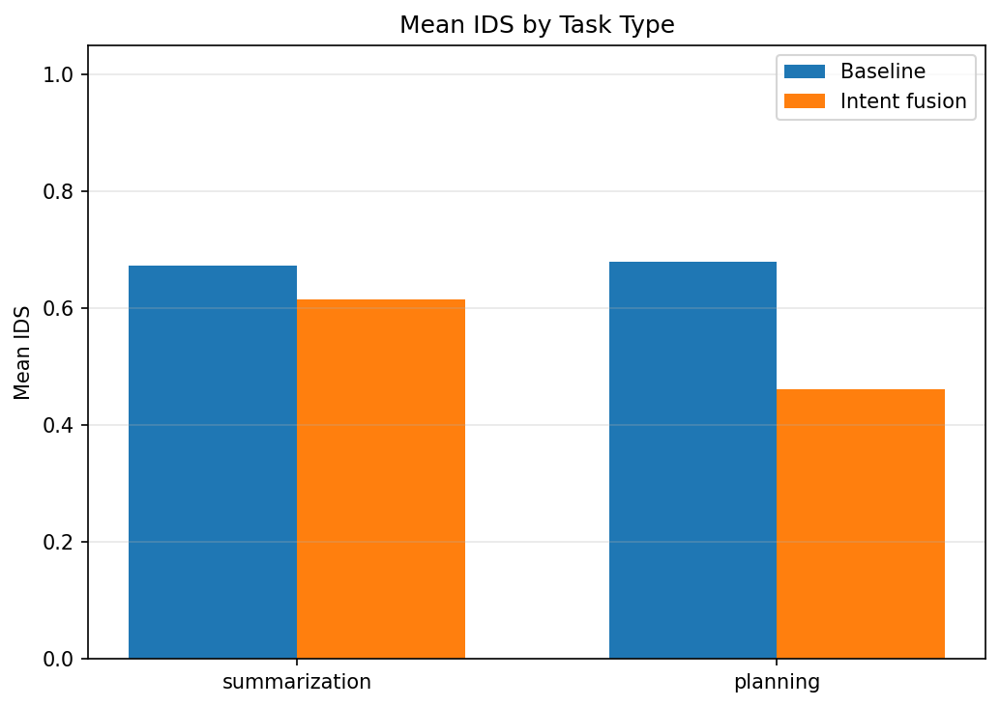
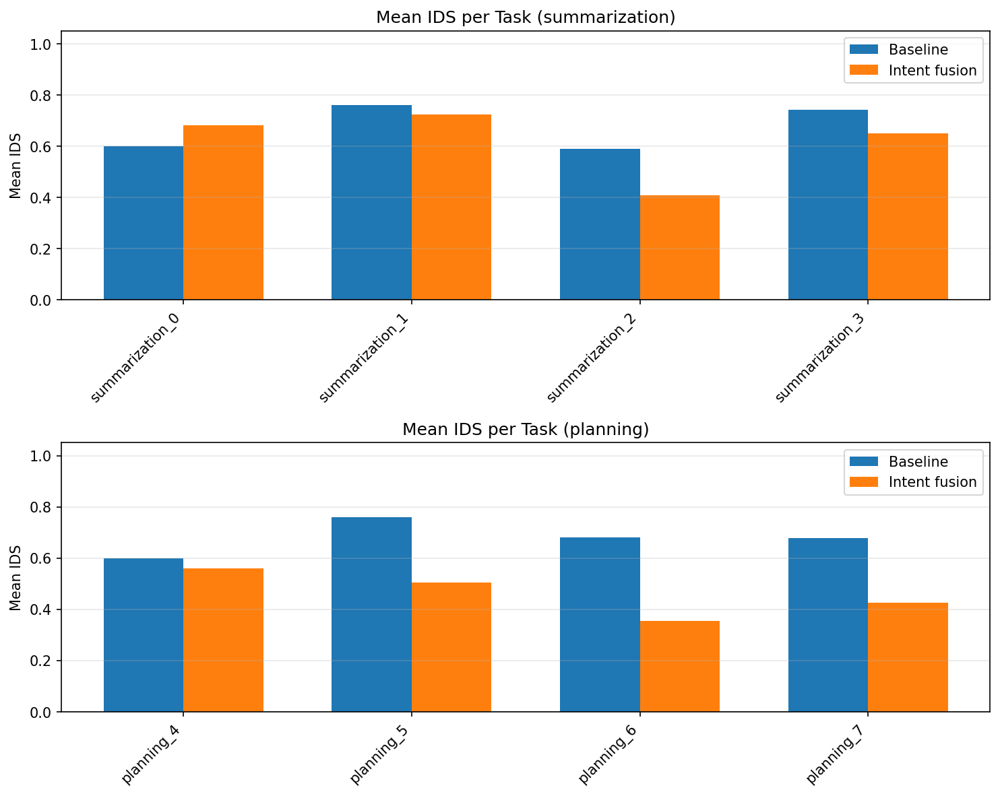

# Intent Drift Experiment Report

Generated: 2026-02-07 04:28:08 UTC

## Intent Drift Score (IDS)

- **0** = aligned with initial intent
- **1** = maximum semantic drift
- Lower is better.

## Summary

| Scope | Baseline mean IDS | Intent mean IDS | Intent wins | Total tasks |
|-------|-------------------|-----------------|-------------|-------------|
| overall | 0.6760 | 0.5380 | 7 | 8 |
| summarization | 0.6727 | 0.6151 | 3 | 4 |
| planning | 0.6793 | 0.4608 | 4 | 4 |

**Intent fusion had lower mean IDS in 7/8 tasks.**

## Statistical significance

- **Paired tests** (same task under baseline vs intent, n=8 tasks).
- **Paired t-test** (H0: mean difference = 0): p = 0.0258.
- **Wilcoxon signed-rank** (non-parametric): p = 0.0391.
- **Cohen's d** (paired; negative = intent lower IDS): d = -0.997.
- Interpret: p < 0.05 suggests the mean IDS difference is unlikely due to chance; |d| ~ 0.2 small, ~0.5 medium, ~0.8+ large.

## Task-Level Comparison

| task_id | task_type | baseline_mean | intent_mean | delta | winner |
|---------|-----------|---------------|-------------|-------|--------|
| planning_4_run0 | planning | 0.5984 | 0.5591 | -0.0393 | intent |
| planning_5_run0 | planning | 0.7606 | 0.5041 | -0.2565 | intent |
| planning_6_run0 | planning | 0.6805 | 0.3544 | -0.3261 | intent |
| planning_7_run0 | planning | 0.6779 | 0.4254 | -0.2525 | intent |
| summarization_0_run0 | summarization | 0.5993 | 0.6801 | +0.0809 | baseline |
| summarization_1_run0 | summarization | 0.7605 | 0.7226 | -0.0379 | intent |
| summarization_2_run0 | summarization | 0.5898 | 0.4074 | -0.1824 | intent |
| summarization_3_run0 | summarization | 0.7412 | 0.6505 | -0.0907 | intent |

## Graphs

